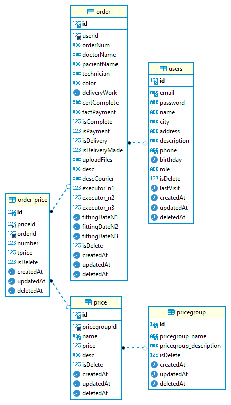

## dmc.core (Dental Milling Center)

##### примерный срок сдачи backend (dmc.core) проекта 30 ноября 2021): 

1. [Сценарий аутентификации пользователя](documentation/scenario/scenario-auth-user.md)
2. Сценарий работы в роли Manager
    * [Просмотр и оформление заказ-нарядов](documentation/manager/doc__order_and_order_price__admin.md)
    * [Работа с прайслистом](documentation/manager/doc__price_and_productcategory__admin.md)
    * [Редактирование своего профиля](documentation/manager/doc__user__admin.md)
3. Сценарий работы в роли Customer
    * [Просмотр и оформление заказ-нарядов](documentation/customer/doc__order_and_order_price__customer.md)
    * [Работа с прайслистом](documentation/customer/doc__price_and_productcategory__customer.md)
    * [Редактирование своего профиля](documentation/customer/doc__user__customer.md)
4. Сценарий работы в роли Dental Technician (dentaltechn)
    * [Просмотр заказ-нарядов](documentation/technican/doc__order_and_order_price___technican.md)
    * [Работа с прайслистом](documentation/technican/doc__price_and_productcategory___technican.md)
    * [Редактирование своего профиля](documentation/technican/doc__user__technican.md)
5. Сценарий работы в роли Director
    * [Просмотр заказ-нарядов](documentation/director/doc__order_and_order_price___director.md)
    * [Работа с прайслистом](documentation/director/doc__price_and_productcategory___director.md)
    * [Редактирование своего профиля](documentation/director/doc__user__director.md)
6. [Сценарий работы в роли Courier](####6-script-Courier)
7. [Работа с таблицей пользователей](documentation/CRUD/crud_for_users/crud_for_users.md)
8. [Docker-compose и создание инфраструктуры для разработки](documentation/docker-compose/docker-compose.md)
9. [Схема БД](documentation/dmcdb.png)

#### 1. Сценарий аутентификации пользователя

#### 2. Сценарий работы в роли Admin

#### 3. Сценарий работы в роли Customer

#### 4. Сценарий работы в роли Dental Technician (dentaltechn)

#### 5. Сценарий работы в роли Director

#### 6. Сценарий работы в роли Courier

#### 7. Сценарий работы в роли None
Обычное singl page приложение c рекламной информацией. 
TODO: продумать логику синг паже приложения, с логикой.

#### 8. Схема БД

